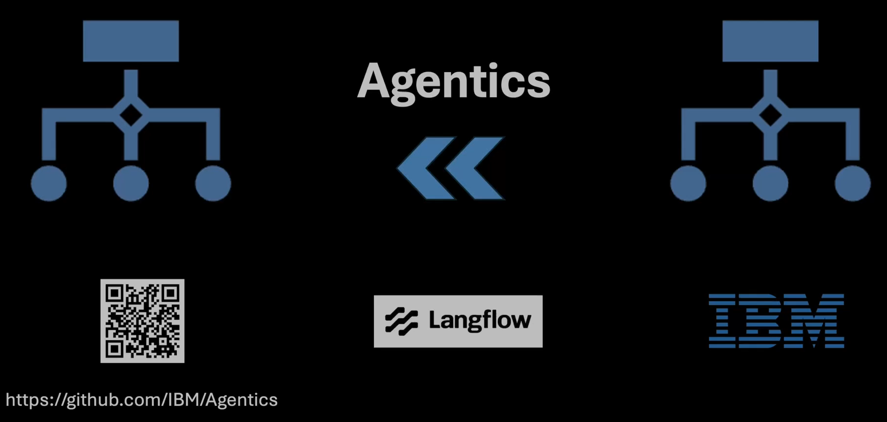

# Agentics Bundle in Langflow 1.8

  

Langflow 1.8 ships with the **Agentics bundle**, three new components that bring LLM-powered tabular data transformation directly into the visual flow builder. 

[Agentics](https://github.com/IBM/agentics/) is an open-source library from IBM that applies a concept called **transduction** to structured data workflows, 
described in the paper ["Transduction is All You Need for Structured Data Workflows"](https://arxiv.org/abs/2508.15610).
Simply to say transduction is LLM-based data transformation applies to the frames or Pydantic models.

Every Agentics component takes a **DataFrame** as input and returns a **DataFrame** as output,
which means they compose naturally with the rest of Langflow's components, such as file loaders, DataFrame Operations, and more.

Agentics bundle gives you a fast, reliable, and zero‑boilerplate way to run LLM-powered data transformations. 
It batches rows asynchronously for high throughput, enforces structured output with Pydantic validation, and handles prompts, parsing, and retries automatically so you get clean, consistent DataFrames without writing custom code.

---
