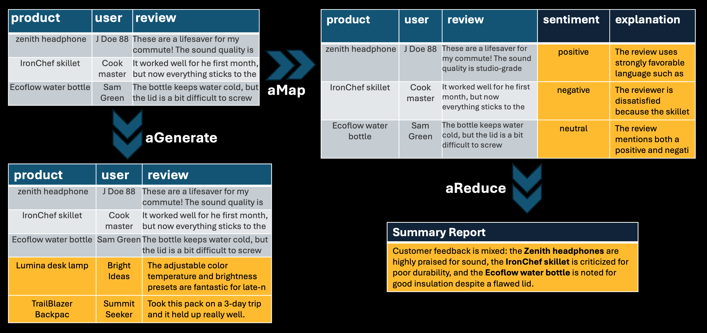
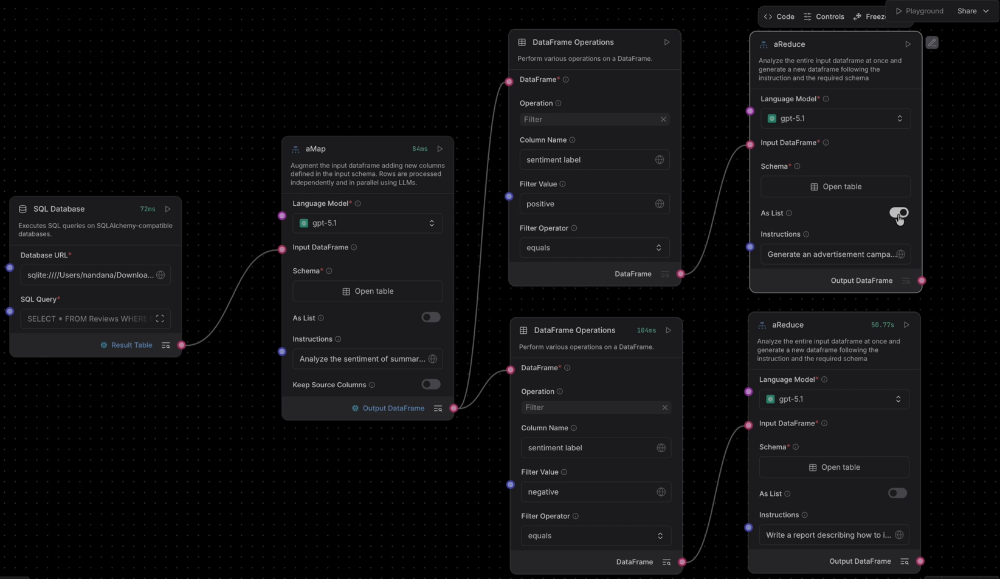
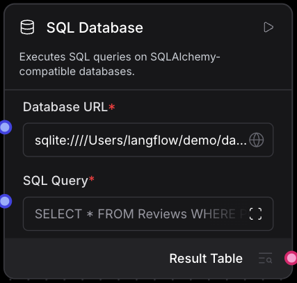
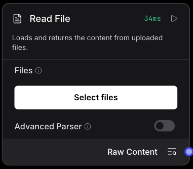
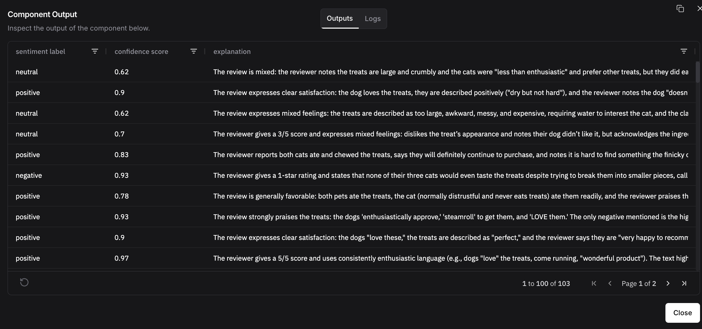
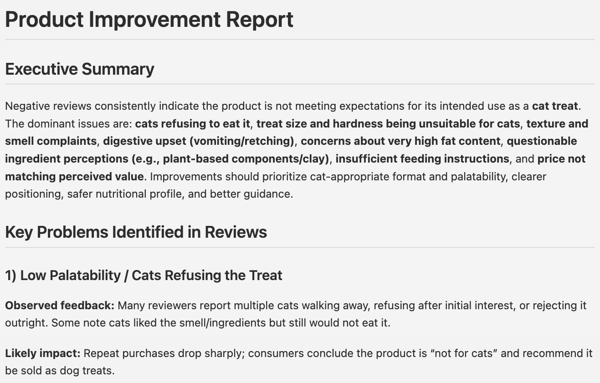

# Transform Tabular Data with LLMs using Agentics Bundle in Langflow

*Written by Alfio Gliozzo, Junkyu Lee, Nandana Mihindukulasooriya*

---
Langflow 1.8 ships with the **Agentics bundle**, three new components that bring LLM-powered tabular data transformation directly into the visual flow builder. 

[Agentics](https://github.com/IBM/agentics/) is an open-source library from IBM that applies a concept called **transduction** to structured data workflows, 
described in the paper ["Transduction is All You Need for Structured Data Workflows"](https://arxiv.org/abs/2508.15610).
Simply to say transduction is LLM-based data transformation applies to the frames or Pydantic models.
Every Agentics component takes a **DataFrame** as input and returns a **DataFrame** as output,
which means they compose naturally with the rest of Langflow's components, such as file loaders, DataFrame Operations, and more.

Agentics bundle gives you a fast, reliable, and zero‑boilerplate way to run LLM-powered data transformations. 
It batches rows asynchronously for high throughput, enforces structured output with Pydantic validation, and handles prompts, parsing, and retries automatically so you get clean, consistent DataFrames without writing custom code.

---

## How it works

<p align="center">
  
  <br>
  <em>Agentics Components: aMap, aReduce, and aGenerate</em>
</p>

Agentics provides a unified abstraction layer over LLM‑based inference, turning raw model calls into typed, and batched transductions. 
The Agentics bundle exposes this as three components:

| Operation | What it does | Langflow component |
|-----------|-------------|-------------------|
| **Map** | Transform each row independently | `aMap` |
| **Reduce** | Aggregate all rows into one | `aReduce` |
| **Generate** | Create new rows from a schema | `aGenerate` |

The three Agentics components in Langflow are grounded in a Map‑Reduce style programming model, where each transformation is treated as a stateless function call applied over well‑defined Pydantic models. 

Instead of issuing individual prompts, parsing ad‑hoc JSON, and managing errors manually, 
Agentics manages these transformations as batched transductions, validates each output against the declared schema, and merges results back into a DataFrame.

This abstraction isolates developers from the operational complexity of LLM calls while providing a scalable, reliable foundation for data-centric pipelines.

* **Typed outputs by design**:  Agentics converts provided schema into a structured prompt and validates every row with Pydantic. This eliminates brittle errors while parsing raw strings into structured output.

* **Scale out throughput**: Transduction workloads run over concurrent async batching and error recovery mechanism to scale out throughput up to the provider's rate limits.


---
## Use Case: Analyzing Product Reviews at Scale

### The Challenge: Manual Review Analysis is Slow and Inconsistent

E-commerce businesses collect thousands of product reviews, but extracting actionable insights from this unstructured data remains a challenge. Consider a typical scenario:

A product manager needs to:
- **Understand customer sentiment** across hundreds or thousands of reviews
- **Identify common complaints** to guide product improvements
- **Extract positive feedback** to inform marketing campaigns
- **Generate structured reports** for stakeholders

### The Traditional Approach Falls Short

Without LLM-powered automation, teams face several bottlenecks:

- **Manual sentiment analysis is slow**: Reading reviews one by one doesn't scale
- **Inconsistent categorization**: Different analysts may interpret sentiment differently
- **No structured output**: Insights remain in emails or documents
- **Difficult to aggregate**: Identifying common themes requires significant  effort
- **Time-consuming report generation**: Creating summaries takes hours

### The Technical Challenge

Even when teams attempt to automate review analysis with LLMs, they encounter problems:

- **Schema inconsistency**: Ad-hoc prompting produces unstructured outputs
- **Sequential processing bottleneck**: Processing reviews one at a time is slow
- **No validation or retry logic**: Failed extractions corrupt the entire pipeline
- **Manual aggregation required**: Summarizing insights requires additional custom code

---

## Agentics + Langflow Solution

<p align="center">
  
  <br>
  <em>Langflow Diagram for the Amazon Food Review</em>
</p>

The Agentics bundle transforms this manual, error-prone workflow into a reliable, scalable pipeline. 
Let's walk through building a complete review analysis system using the **Amazon Fine Food Reviews** dataset.

### Preliminary

#### Install and run Langflow
```bash
uv pip install langflow
uv pip install agentics-py==0.3.1
uv run langflow run
```

#### Prepare Dataset
We'll use the [Amazon Fine Food Reviews dataset from Kaggle](https://www.kaggle.com/datasets/snap/amazon-fine-food-reviews), which contains authentic product reviews with fields like:
- Product ID and User ID
- Review summary and full text
- Ratings and timestamps

For this example, we'll focus on reviews for a pet food product to demonstrate how Agentics handles real-world, unstructured feedback.

### Build the Flow

#### Step 1: Load Data with SQL Database Component
Download SQLite database file from Kaggle and load it into Langflow.

<p align="center">
  
  <br>
  <em>SQL Database Component</em>
</p>

* Enter Database URL:
```
sqlite:////<path_to_file>/database.sqlite
```
* Select pet food reviews by providing the following SQL Query
```
SELECT * FROM Reviews WHERE ProductId =  'B006Q7YG56'
```
#### Step 1.1: Loading Data From CSV file
Alternatively, you can load data from a CSV file.
<p align="center">
  
  <br>
  <em>Read File Component</em>
</p>


#### Step 2: Sentiment Classification with aMap

After loading data, 
the first step is transforming each review with structured sentiment data.

- Add an **aMap** component from the Agentics bundle (found under Bundles in Langflow)
- Define a schema with three new columns:
  - `sentiment_label` (string): "positive", "negative", or "neutral"
  - `confidence_score` (float): Confidence score from 0 to 1
  - `explanation` (string): Brief reasoning for the sentiment classification
- Provide an instruction to guide the LLM:
```
# Task Description
Perform sentiment analysis task on the input data.
Examine summary and text field,
if the sentiment is good then sentiment label is positive.
if the sentiment is bad then sentiment label is negative.
if the sentiment is neither good or bad then sentiment label is neutral.

## Constraint
* The sentiment label must take values **positive**, **negative**, **neutral**. No other labels are allowed, such as good, bad, mixed, etc.
* Confidence score is the degree of confidence that the assigned sentiment value is truthful. Generate floating point number between 0 and 1.0. 0 indicates no confidence at all, and 1.0 indicates absolutely confident. The sentiment score must be greater than equal to 0 and less than or equal to 1.0.
* Explanation gives the support why the sentiment value was assigned from the input summary and text field.
```

The aMap component processes each review row independently using parallel agents. Instead of writing custom parsing logic, you define the schema in the UI, and Agentics:
- Generates structured prompts automatically
- Validates outputs against the Pydantic schema
- Handles retries for failed LLM calls
- Returns a clean DataFrame with the new columns

**Output example:**
As the component runs, you can monitor progress in the console as it processes rows in parallel. 
Once complete, the Target DataFrame displays all three generated fields with consistent, validated data.

<p align="center">
  
  <br>
  <em>Output Dataframe with Structured Sentiment Data</em>
</p>


#### Step 3: Filtering Reviews by Sentiment
Once sentiment is extracted, we use Langflow's **DataFrame Operations** component to split the data:

- **Positive reviews** (sentiment_label = "positive") → Feed into marketing campaign generation
- **Negative reviews** (sentiment_label = "negative") → Feed into product improvement analysis

This filtering step demonstrates how Agentics components compose naturally with Langflow's existing data manipulation tools.

#### Step 4: Product Improvement Report with aReduce

Now we aggregate negative reviews into actionable insights.
- Add an **aReduce** component to process all negative reviews
- Define a schema with one field:
  - `improvement_report` (string): Structured report with problem areas and recommendations
- Provide an instruction for aggregation:
```
Write a report describing how to improve the product given the negative reviews. 
Generate the report in Markdown.
```
The aReduce component processes all rows in the DataFrame collectively, identifies patterns and themes across reviews, 
and generates a single, structured output conforming to the schema

**Output example:**
This report provides the product team with clear, data-driven insights derived from customer feedback at scale.

<p align="center">
  
  <br>
  <em>Report Generated by aReduce Component</em>
</p>

#### Step 5: Marketing Campaign Brief with aReduce

For positive reviews, we generate structured data for an advertising campaign.
- Add another **aReduce** component for positive reviews
- Define a richer schema:
  - `ad_title` (string): Catchy advertisement headline
  - `ad_text` (string): Compelling ad copy
  - `positive keywords` (list): positive keywords
  - `negative keywords` (list): negative keywords
  - `target audience` (string): target audience
- Provide an instruction for campaign generation:
```
Generate an advertisement campaign for Google ads for the product highlighting the positive aspects of the product.
```
- Enable the **"as List"** option in the aReduce component to generate multiple campaign variations from the same data.

**Output example:**
One of the structured output following the provided schema. 
```json
{
  "ad_title": "Raw Boost Bites Freeze-Dried Treats",
  "ad_text": "Give dogs & cats a treat they go crazy for. High-protein, grain-free, no artificial colors or preservatives. Easy to break into training pieces, low odor, made in the USA—pets love the taste and owners love the ingredients.",
  "positive_keywords": ["Raw Boost Bites",  "freeze dried pet treats", "no artificial preservatives pet treats", ...],
  "negative_keywords": ["free", "cheap", "bulk", ... ],
  "target_audience": "Pet owners (dog and cat owners) seeking high-quality, healthy, grain-free, high-protein treats with clean ingredients; especially those interested in freeze-dried/raw-style treats, training treats that break into small pieces, and options for pets with sensitivities/allergies."
}
```
The marketing team now has ready-to-use campaign materials grounded in actual customer feedback, 
complete with targeting parameters for ad platforms.

#### Why This Approach Works

This workflow demonstrates the core strengths of the Agentics bundle:

1. **Typed, validated outputs**: Every field conforms to the declared schema—no parsing errors or inconsistent formats
2. **Parallel execution**: aMap processes multiple reviews concurrently, respecting rate limits while maximizing throughput
3. **Composable operations**: Map and Reduce operations chain naturally with Langflow's existing components
4. **Zero boilerplate**: No custom prompt engineering, parsing logic, or retry handling required
5. **Visual, reproducible**: The entire pipeline is built in Langflow's canvas and can be shared, versioned, and deployed


---

## Conclusion

The Agentics bundle in Langflow 1.8 makes LLM-powered tabular data transformation a first-class citizen in the visual flow builder. 

With Agentics, you move beyond ad‑hoc “prompt and parse” experiments into a stable, scalable pattern for real LLM‑driven data workflows. 
Langflow with the three Agentics components — **aMap**, **aReduce**, and **aGenerate** — cover the full lifecycle of structured data work: enriching rows, aggregating insights, and synthesizing new data.

Instead of wrestling with inconsistent schemas, parsing failures, or manual batching logic, you stay focused on the intent of the workflow while Agentics handles the batching, validation, retries, and schema enforcement behind the scenes. This integration lets you continue working in a visual, low‑code environment while Agentics scales the underlying LLM operations to meet real‑world data requirements.


---

*See also:*
- [Agentics official documentation](https://ibm.github.io/Agentics/)
- [Agentics GitHub repository](https://github.com/IBM/agentics/)
- [Transduction is All You Need for Structured Data Workflows (arXiv)](https://arxiv.org/abs/2508.15610)
- [Langflow global variables configuration](https://docs.langflow.org/configuration-global-variables)
- [Agentics bundle documentation](https://docs.langflow.org/bundles-agentics)
- [J. McAuley and J. Leskovec. From amateurs to connoisseurs: modeling the evolution of user expertise through online reviews. WWW, 2013.](http://i.stanford.edu/~julian/pdfs/www13.pdf)